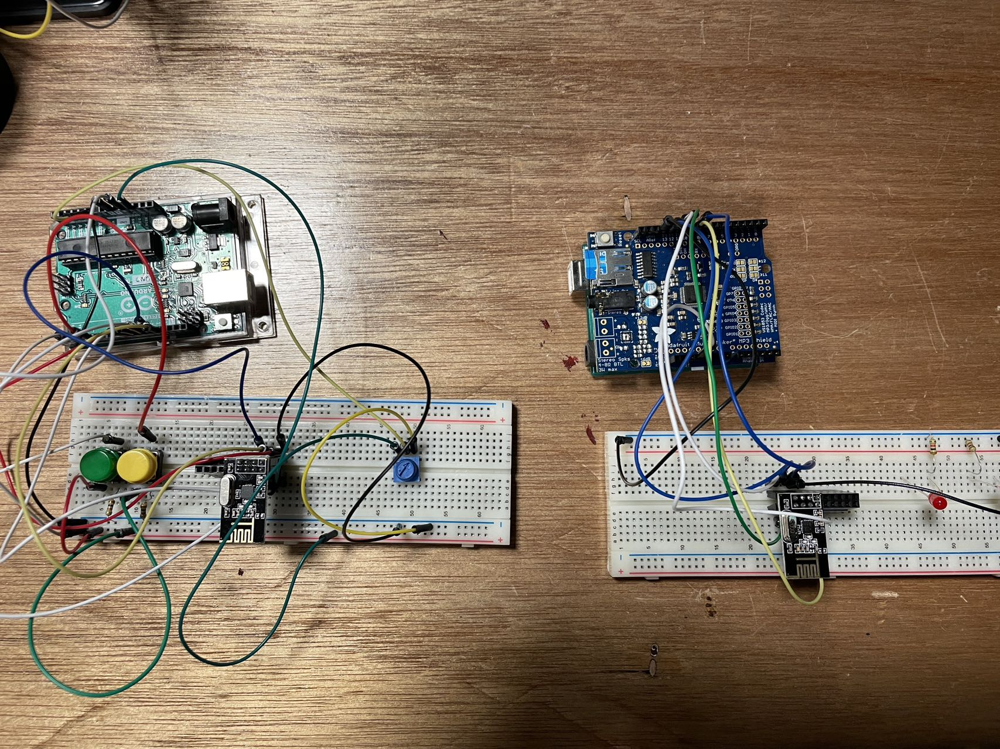

# Add the ability to control which track is playing from the transmitter

Me and Alpha worked it for the whole afternoon to figure it out. At first we try to combine the Adafruit codes with the previous code we have for transmitter and receiver. But then we saw that it reported as "initialization failed".
After trying couple of time, we successfully solved the problem.

