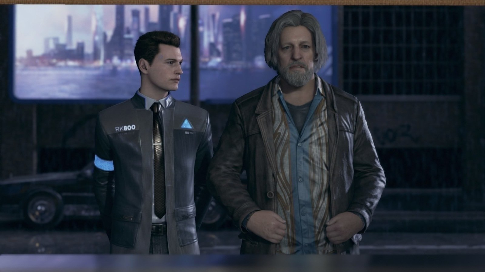

# Response on ‘Thinking Something Makes It So’: Performing Robots, the Workings of Mimesis and the Importance of Character
"When the robot finds humanlike form, the question becomes even more specific: can the robot become a human?". After reading this article, I realized when robots are becoming more and more like to a human, human can also somehow be more and more like a robot. In terms of the aspect of actors' performance, in Hirata's play, he would view his actors as "chess pieces, to be controlled by the playwright and director" (LePage 2016), and like human actors, the robots would "just recite the selected dialogues" (Hirata 2013). When the roles and responsibilities of actors are defined in this way, we find that both humans and robots are "manipulated", so that in the context of the stage, the boundaries between human and robot identities are blurred.

The author also put forward a very interesting point of view, which is "personality can make human feel more empathy for an android than a human". She again uses the example in "Three Sisters" - In this play, "Android and human Ikumi share qualities at the level of personality, too: they are both quiet, thoughtful and have a tendency to be abrupt, which sometimes topples over into rudeness". However, "in comparison with human Ikumi, the android is relatively sociable, warm and responsive", whereas the human Ikumi is "comparatively cold, frequently dissatisfied, is less eager to please and her voice has a harder, flatter quality to it" (LePage 2016). 

As a Social Science student, I tend to relate this to the idea of Social Construction. We tend to label things that are "vibrant" and "energetic" as "human", and this tradition emerges after Renaissance. In constrast, those that are "cold" and "numb" are labeled as "inhuman", which in the conext that we discussed, are labeled as "robots". In this way, we can see that in social construction, robots are still synonymous with words such as "numbness". Therefore, a peculiar experience arises when the robot acquires a human's characteristics. 

Thus I wonder, when robots become very similar to humans (like those androids in Detroit: Become Human), will human consider them more human than those humans who "lack humanity"? While this is remain debateable, for now, we may think more about how to make robots more human-like, not only from the appearance aspect, but also from the mentality aspect.

